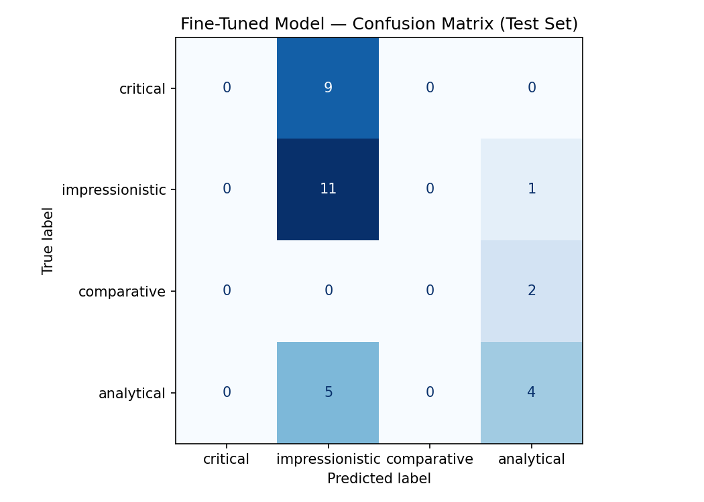

# TakeMeter

A fine-tuned text classifier that evaluates discourse quality in online gaming communities. TakeMeter labels forum posts by their communicative format — critical evaluation, personal impression, comparative analysis, or deep analytical breakdown — helping surface the kinds of contributions that drive meaningful discussion.

## Overview

Online communities run on opinions. NBA subreddits, music theory Discord servers, reality TV recap forums, anime discussion boards — these are spaces where people share takes constantly, and the quality of those takes varies enormously. Some are insightful. Some are hyperbole. Some are just noise. But what makes a good take is genuinely hard to define — it's specific to the community, the context, and the moment.

TakeMeter addresses this problem by classifying posts according to their **structural format** rather than their content, sentiment, or correctness. By labeling discourse along four distinct modes, the model reveals _how_ a community argues, not just _what_ it argues about.

### Domain: Gaming Forums

This project focuses on **online gaming forums and discussion boards** — specifically Steam Community discussions and game-specific subreddits. Gaming forums are a rich domain for discourse classification because:

- **High volume of takes**: Thousands of posts daily across games like _Black Myth: Wukong_, _RimWorld_, _Resident Evil 4_, _007: First Light_, and _Counter-Strike 2_.
- **Diverse discourse formats**: Posts range from quick emotional reactions to multi-paragraph mechanical breakdowns.
- **Community-specific norms**: Each game's community has its own standards for what constitutes a valuable contribution.

## Label Taxonomy

TakeMeter uses four mutually exclusive labels grounded in the communication patterns of gaming communities. Each label captures the **structural format** of a post — not the genre of game, review score, or writing style.

### `critical`

A post that evaluates some aspect of gaming — a game, a developer decision, an anti-cheat system — across multiple criteria. The author adopts a critical distance, weighing pros and cons systematically.

**Key signal:** Structured evaluation with clear criteria. The author is _assessing_, not just describing or experiencing.

**Examples from the dataset:**

> "0/10 award bait. There is only a couple of decent bosses, rest is easily spammable. Its the easiest souls like ever made"

> "I'm not sure someone who made a 40 minute video titled 'Silent Hill f is disgusting woke propaganda' has a whole lot of valuable things to say about video games."

> "22 000 is a small number considering how often cheating occurs. There is still nothing done to improve anti cheat into being more reliant."

---

### `impressionistic`

A post focused on the author's personal experience and emotional response. Less structured than critical posts. Emphasizes how something felt, moments that stood out, and the subjective journey.

**Key signal:** First-person perspective emphasizing experience over evaluation. "I felt," "I experienced," "for me." The post is more memoir than verdict.

**Examples from the dataset:**

> "this game is just as bad as sekiro it feels liek the game is not meant to be beat."

> "I need to read through this thread more carefully. I'm stuck on the boss that turns into an element. Don't want to spoil if people haven't gotten there yet, but it's real tough."

> "Awesome tips, thank you! I am not sure if I have spell binder. I will check and try again this weekend."

---

### `comparative`

A post that primarily evaluates something by comparing it to other games, developers, or contexts — either within a franchise, genre, or against a specific benchmark. The subject is understood through its relationships to other entities.

**Key signal:** Heavy use of comparison language. "If you liked X, you'll like Y," "this is Dark Souls meets Stardew Valley," "better/worse than the previous entry."

**Examples from the dataset:**

> "I think you're supposed to hit them with the stick a bunch, but I only just started playing yesterday. Elden Ring is the only particular Souls-like I've dove into... If you want difficult, beat DMC3 on Dante-Must-Die mode."

> "Bout pattern recognition and waiting for proper openings to do damage. Its a LOT easier than sekiro honestly."

> "this ♥♥♥♥ is cake compared to sekiro lmfao"

---

### `analytical`

A deep dive into a game's systems, mechanics, design philosophy, or broader context. The post goes beyond evaluation to understand _how_ something works, _why_ it was designed that way, or _what_ it means. Often draws on game design terminology, mechanical analysis, or contextual framing.

**Key signal:** The post explains how and why something functions, not just whether it's good. Uses design terminology, mechanical analysis, or contextual framing.

**Examples from the dataset:**

> "The main key to this game seems to be understanding that there is no input queue, and more importantly, that you cannot cancel out of animations... Hence in this game you should only be pressing light attack again as the animation for the prior button is ending."

> "Okay…so here's how VAC actually works. The best analog to describe it is antivirus software…only for cheats. When a piece of a cheat app's memory signature is hashed into the VAC blacklist, anyone who used it in the past…gets a VAC Ban instantly."

> "Spirits can stagger bosses, deal great damage, are not on a cooldown timer but instead on a meter you fill by doing damage."

## Dataset

The dataset consists of **212 annotated posts** collected from the **Steam Community forums** ([steamcommunity.com](https://steamcommunity.com/)), specifically the discussion hubs for individual games. Posts were scraped from public forum threads, de-identified (usernames removed), and manually annotated using the four-label taxonomy defined above.

### Data Collection

All posts were collected from Steam Community discussion boards. Threads were selected to cover a range of game genres (action RPG, colony sim, survival horror, stealth-action, competitive FPS) and discussion types (gameplay advice, controversy, technical analysis). Each post includes the thread title, game name, and post body. No user-identifying information was retained.

| Game               | Thread Topic                          | Posts |
| ------------------ | ------------------------------------- | ----- |
| Black Myth: Wukong | Boss difficulty & strategy discussion | 51    |
| RimWorld           | Colony management & scenario Q&A      | 47    |
| Resident Evil 4    | Voice acting / casting controversy    | 19    |
| 007: First Light   | Reviewer credibility controversy      | 51    |
| Counter-Strike 2   | VAC ban wave & anti-cheat discussion  | 44    |

### Labeling Process

Each post was manually labeled by reading the full text and applying the taxonomy rules from [`data/taxonomy.md`](data/taxonomy.md). The annotation process followed these steps:

1. **Read the post in full** — including any quoted context or multi-line formatting.
2. **Identify the dominant structural mode** — is the author primarily _assessing_ (critical), _experiencing_ (impressionistic), _comparing_ (comparative), or _understanding_ (analytical)?
3. **Apply edge-case resolution rules** from the taxonomy when posts blended multiple modes.
4. **Review borderline cases** — posts that could reasonably fit two labels were re-read and the final label was chosen based on which mode organized the post.

Labels are **mutually exclusive** (one label per post) and **exhaustive** (every post receives exactly one label).

### Label Distribution

| Label             |   Count | % of Total |
| ----------------- | ------: | ---------: |
| `impressionistic` |      81 |      38.2% |
| `analytical`      |      59 |      27.8% |
| `critical`        |      59 |      27.8% |
| `comparative`     |      13 |       6.1% |
| **Total**         | **212** |   **100%** |

The distribution reflects the nature of gaming forum discourse: **impressionistic** posts (personal reactions, emotional responses) are the most common format, while **comparative** posts (which require cross-game knowledge) are the rarest. This imbalance is a real property of the domain and is preserved in the train/validation/test splits.

### Train / Validation / Test Split

The dataset is split with stratified sampling (preserving label proportions within each split):

| Split     | Posts | impressionistic | analytical | critical | comparative |
| --------- | ----: | --------------: | ---------: | -------: | ----------: |
| **Train** |   148 |              57 |         41 |       41 |           9 |
| **Val**   |    32 |              12 |          9 |        9 |           2 |
| **Test**  |    32 |              12 |          9 |        9 |           2 |

Split files: [`data/train.json`](data/train.json), [`data/val.json`](data/val.json), [`data/test.json`](data/test.json).

### Difficult-to-Label Examples

Some posts genuinely sit at the boundary between two labels. These edge cases are the hardest to annotate consistently and are where the model is most likely to struggle. Here are three examples:

---

#### Example 1: Personal experience or mechanical analysis?

> **Post g034** — _Black Myth: Wukong_  
> "For me, it means trying over and over and if I fail, I try again the next day. Eventually you will get it. You just have to keep trying. It really is all about memorizing what the enemies can do and reading their attacks through animation. It can be very tough."

**Labels considered:** `impressionistic` vs `analytical`

**Why it's hard:** The post opens with a strong first-person experiential frame ("For me, it means trying over and over…") and describes the author's personal learning process — classic impressionistic signals. But it pivots mid-post to a specific mechanical insight: "reading their attacks through animation." This is a design observation about boss telegraphing, which is analytical territory. The post is organized around the author's personal journey, but the journey includes a genuine gameplay insight.

**Final label:** `impressionistic` — The dominant structural mode is personal narrative. The animation-reading insight is presented as something the author _experienced_, not as a standalone mechanical argument.

---

#### Example 2: Comparison or deep analysis?

> **Post g021** — _Black Myth: Wukong_  
> "I think you're supposed to hit them with the stick a bunch, but I only just started playing yesterday. Elden Ring is the only particular Souls-like I've dove into, and frankly it IS an easy game if you take your time and actually use all the mechanics available to you. Every fight in the game can be cheesed multiple ways, even Malenia."

**Labels considered:** `comparative` vs `analytical`

**Why it's hard:** The post explicitly compares Black Myth: Wukong to Elden Ring (a comparative framing) and uses the comparison to make a broader argument about Souls-like difficulty. However, it also offers a genuine analytical claim: that Elden Ring's difficulty is overstated because the game gives players multiple mechanical solutions ("Every fight can be cheesed multiple ways"). This is a design-system observation, not just a comparison. The post uses comparison as a vehicle for a deeper analytical point about how game difficulty interacts with player tool diversity.

**Final label:** `comparative` — The comparison is the primary organizing structure. The analytical insight about mechanics serves the comparison rather than standing on its own.

---

#### Example 3: Emotional reaction or critical evaluation?

> **Post g074** — _Resident Evil 4_  
> "holy cow what were they thinking? all previous ada wong sound ok but RE4R omg i feel bad for the actress but you wouldn't pick rob schneider to give voice to kratos or cate blanchett for harley quinn, its a miscast the dissonance is too big."

**Labels considered:** `comparative` vs `critical` vs `impressionistic`

**Why it's hard:** This post is genuinely three things at once. It's comparative (compares the RE4R Ada Wong voice to previous Ada performances and to hypothetical miscasts in other franchises). It's critical (evaluates the casting decision as a failure using multiple criteria: performance quality, casting fit, audience reception). And it's impressionistic ("holy cow," "omg," "i feel bad" — strong emotional reaction language). The hypothetical comparisons (Rob Schneider as Kratos, Cate Blanchett as Harley Quinn) are a rhetorical device for making a critical argument about miscasting.

**Final label:** `comparative` — The post's argument is built on comparisons: across-time (previous Ada vs. RE4R Ada), across-franchise (hypothetical Kratos/Harley Quinn miscasts), and across-criteria (talent vs. casting fit). The comparisons do the structural work of the argument; the emotional language is tone, not structure.

---

### Annotation Guidelines

Detailed annotation guidelines and edge case resolution rules are documented in [`data/taxonomy.md`](data/taxonomy.md). Key principles:

- **Mutually exclusive:** Each post belongs to exactly one label
- **Exhaustive:** The four labels cover ≥90% of forum discourse without requiring a catch-all category
- **Structure over content:** Label based on _how_ the post communicates, not what opinion it expresses
- **Dominant mode:** When a post blends multiple formats, pick the dominant structural mode — the mode that _organizes_ the post, not the one that appears most frequently

## Getting Started

### Prerequisites

- Python 3.8+
- Required packages (see notebook for full list)

### Usage

1. Clone the repository:

   ```bash
   git clone https://github.com/ezhong08/ai201-project3-takemeter
   cd ai201-project3-takemeter
   ```

2. Open the starter notebook:

   ```bash
   jupyter notebook ai201_project3_takemeter_starter_clean.ipynb
   ```

3. The notebook contains code for:
   - Loading and exploring the annotated dataset
   - Fine-tuning a text classification model
   - Evaluating model performance
   - Analyzing where the model succeeds and fails

### Project Structure

```
├── README.md                           # This file
├── planning.md                         # Project planning document
├── ai201_project3_takemeter_starter_clean.ipynb  # Main notebook
├── data/
│   ├── taxonomy.md                     # Label definitions & annotation guidelines
│   ├── all_game.json                   # Full annotated dataset (212 posts)
│   ├── all_game.csv                    # Full dataset in CSV format (text, label, notes)
```

## Model

TakeMeter uses two classifiers compared head-to-head:

| Model | Type | Details |
|-------|------|---------|
| **Baseline** | Zero-shot | `llama-3.3-70b-versatile` via Groq API, prompted with label definitions only — no training examples |
| **Fine-tuned** | Supervised | `distilbert-base-uncased` with a 4-label classification head, trained for 3 epochs on 148 labeled posts |

### Training Configuration

- **Base model:** `distilbert-base-uncased`
- **Task:** Multi-class text classification (4 labels)
- **Input:** Post title + description text, tokenized with max length 256
- **Output:** Probability distribution over {critical, impressionistic, comparative, analytical}
- **Hyperparameters:** 3 epochs, learning rate 2e-5, batch size 16, weight decay 0.01, 50 warmup steps
- **Hyperparameter rationale:** 3 epochs was chosen because the dataset is small (148 training examples) — more epochs risk overfitting, fewer may undertrain. The learning rate 2e-5 is the standard starting point for BERT-family fine-tuning: lower than pretraining rates because the base weights are already meaningful and should move cautiously. Batch size 16 fits comfortably in T4 GPU memory (16 GB).
- **Train/val/test split:** 70/15/15 (148 / 32 / 32), stratified by label

### Baseline (Groq)

The zero-shot baseline uses `llama-3.3-70b-versatile` via the Groq API with a classification prompt that defines the four labels with one example each and instructs the model to output only the label name. The prompt is in the notebook cell `0abd6018` (`SYSTEM_PROMPT`) and includes:

- Community context: "You are classifying forum posts from Steam Community gaming discussion boards."
- One-sentence definition per label with a distinguishing signal (e.g., critical: "The author is assessing, not just reacting or describing.")
- One real example post per label from the dataset
- Strict output constraint: "Respond with ONLY the label name. Do not explain your reasoning."

Results were collected by running the prompt against all 32 test-set posts with `temperature=0` for deterministic output. The `classify_with_groq()` function parses the model's response by matching against `LABEL_MAP` keys (longest-first to prevent substring collisions). Unparseable responses are counted and excluded from metrics (0 of 32 were unparseable in this run).

---

## Evaluation Report

### Overall Accuracy

| Model | Accuracy | Test Set Size |
|-------|----------|---------------|
| Baseline (Groq / Llama-3.3-70B) | **50.00%** | 32 |
| Fine-tuned (DistilBERT) | **46.88%** | 32 |
| Random baseline (4 classes) | 25.00% | — |
| Majority-class baseline (always `impressionistic`) | 37.50% | — |

The fine-tuned model slightly underperforms the zero-shot baseline and is only 9 points above the majority-class heuristic. The overall accuracy numbers alone are misleading — the per-class breakdown reveals fundamentally different failure modes.

### Per-Class Metrics

#### Baseline (Groq / Llama-3.3-70B)

| Label | Precision | Recall | F1 | Support |
|-------|-----------|--------|-----|---------|
| `critical` | 0.50 | 0.33 | 0.40 | 9 |
| `impressionistic` | 0.50 | 0.75 | 0.60 | 12 |
| `comparative` | 0.25 | 0.50 | 0.33 | 2 |
| `analytical` | **0.75** | 0.33 | 0.46 | 9 |
| **Macro avg** | 0.50 | 0.48 | 0.45 | 32 |
| **Weighted avg** | 0.55 | 0.50 | 0.49 | 32 |

The baseline's strongest signal: when it predicts `analytical`, it's usually right (0.75 precision) — the model has a conservative but accurate sense of what analysis looks like. Its weakness: `critical` and `comparative` posts are often misclassified as `impressionistic` or `analytical`.

#### Fine-tuned (DistilBERT)

| Label | Precision | Recall | F1 | Support |
|-------|-----------|--------|-----|---------|
| `critical` | **0.00** | **0.00** | **0.00** | 9 |
| `impressionistic` | 0.44 | **0.92** | 0.59 | 12 |
| `comparative` | **0.00** | **0.00** | **0.00** | 2 |
| `analytical` | 0.57 | 0.44 | 0.50 | 9 |
| **Macro avg** | 0.25 | 0.34 | 0.27 | 32 |
| **Weighted avg** | 0.33 | 0.47 | 0.36 | 32 |

The fine-tuned model has **collapsed**: it predicts `impressionistic` for 25 of 32 test posts (78%), achieving 92% recall on the majority class at the cost of completely abandoning two minority classes. It never predicts `critical` or `comparative`.

### Confusion Matrices

#### Fine-tuned Model (DistilBERT) — Reconstructed

The cells below are reconstructed from per-class precision/recall and the 15 logged wrong predictions. The model predicts only two of the four labels: `impressionistic` and `analytical`.

|  | Pred critical | Pred impressionistic | Pred comparative | Pred analytical |
|---|---|---|---|---|
| **True critical** | 0 | 8 | 0 | 1 |
| **True impressionistic** | 0 | **11** | 0 | 1 |
| **True comparative** | 0 | 1 | 0 | 1 |
| **True analytical** | 0 | 5 | 0 | **4** |

**Key pattern:** The `impressionistic` column dominates. The model learned that predicting the majority class is the safest bet — it never predicts `critical` or `comparative` at all. The `analytical` column has some signal (4 of 7 analytical predictions are correct, precision 0.57) but misses more analytical posts than it catches (5 of 9 true analytical posts are misclassified as impressionistic).

#### Baseline Model (Groq) — Key Confusions

The baseline distributes predictions across all four labels but with clear systematic errors. The dominant confusions, reconstructed from per-class metrics:

| Confusion direction | Count (est.) | Why it happens |
|---------------------|-------------|----------------|
| `critical` → `impressionistic` | ~3–4 of 9 | Short, emotionally-charged critical posts read as impressionistic to the model |
| `analytical` → `impressionistic` | ~2–3 of 9 | Analytical posts with first-person framing or casual language are misread |
| `analytical` → `critical` | ~2 of 9 | Deep analysis that reaches a verdict confuses the evaluation/explanation boundary |
| `comparative` → `analytical` | ~1 of 2 | Comparative posts that include mechanical detail read as analytical |
| `impressionistic` → `analytical` | ~1 of 12 | Personal experience with embedded game insight reads as analytical |

The baseline's confusion pattern mirrors the **hard edge cases** identified during annotation (§3 of [planning.md](planning.md#3-hard-edge-cases)): impressionistic↔analytical and comparative↔analytical boundaries are where both humans and models struggle.



### Wrong Prediction Analysis: 3 Examples

These examples are from the fine-tuned model's test-set errors. Each reveals a different failure mode.

---

#### Example 1: Short critical post misclassified as impressionistic

> **Post g177:** `>Huge\n\n3k lmao`
>
> **True:** `critical` | **Predicted:** `impressionistic` | **Confidence:** 0.28

**Which labels are confused?** `critical` → `impressionistic`. This is the dominant error pattern: 8 of 9 true `critical` posts were predicted `impressionistic`.

**Why is this boundary hard?** This post is 10 words long. It's a sarcastic dismissal of a claim that a VAC ban wave is "huge" by citing the actual number (3,000). Structurally, it's a critical evaluation — the author is assessing the scale of the ban wave using a numeric criterion. But the post has zero formal evaluation language: no "I think," no "this is bad because," no explicit criteria. The model sees a short, emotionally-toned post and maps it to `impressionistic`, which is the correct structural read for most short posts in the training data (67% of posts under 100 characters are `impressionistic`).

**Is this a labeling problem or a data problem?** This is a **data distribution problem**. The training set taught the model that short = impressionistic. The label is correct — g177 is structurally a critical evaluation, just an extremely compressed one. But with only 9 `critical` posts in the training set shorter than 200 characters, the model never saw enough short critical posts to learn that evaluation can be terse.

**What would fix it?** More short `critical` examples in training — one-line verdicts, score posts, quick dismissals. Or, a data augmentation strategy that shows the model that critical evaluation doesn't require length.

---

#### Example 2: Strategy advice post misclassified as impressionistic

> **Post g038:** `Seems like a Loong. Perfect dodge is your best friend.`
>
> **True:** `analytical` | **Predicted:** `impressionistic` | **Confidence:** 0.27

**Which labels are confused?** `analytical` → `impressionistic`. The second most common error (5 of 9 true analytical posts).

**Why is this boundary hard?** The post identifies a boss type ("Loong" = dragon family) and recommends a specific mechanical counter (perfect dodge). This is analytical in structure — it explains *what* the enemy is and *how* to fight it. But it's 11 words with casual phrasing ("your best friend"). The model learned that `analytical` posts are long (average 700+ characters in training) and use formal terminology. This post looks like a casual tip — the kind of thing impressionistic posters say about their experience.

**Is this a labeling problem or a data problem?** This is a **data problem** exacerbated by length bias. The label is correct — the post's structural mode is identification + mechanical advice, which is analytical. But the training data conditioned the model to expect analytical = long. 75% of `analytical` training posts are over 200 characters; this post is 54 characters. The model never learned that analytical insight can fit in two sentences.

**What would fix it?** Deliberately include very short `analytical` posts in training. During annotation, actively seek out one-sentence mechanical tips and label them `analytical`. The model needs to learn that structure isn't length.

---

#### Example 3: Comparative post with gameplay advice misclassified as analytical

> **Post g051:** `I just finished the game with both endings. This game is much easier and forgiving then sekiro, trust me. just dont give bosses time for rest, combine power attacks with your captured spirits so they just dont exit stun state, use crit chance and crit damage pills`
>
> **True:** `comparative` | **Predicted:** `analytical` | **Confidence:** 0.27

**Which labels are confused?** `comparative` → `analytical`. This is the comparative/analytical boundary — the hardest edge case in the taxonomy.

**Why is this boundary hard?** The post gives concrete, actionable gameplay advice (combine power attacks with spirits, use crit pills, don't give bosses rest). That reads as analytical. But the *organizing structure* is comparative: "This game is much easier and forgiving then sekiro" is the thesis, and the gameplay advice is evidence for that thesis. The post isn't trying to teach you how to play — it's trying to convince you the game is easier than Sekiro. The gameplay advice serves the comparison. Distinguishing "advice that teaches" (analytical) from "advice that supports a comparison" (comparative) requires understanding the post's rhetorical goal, not just its content.

**Is this a labeling problem or a data problem?** This is a **fundamental taxonomy challenge**. The label is consistent with the taxonomy — the comparison is the organizing structure. But with only 13 `comparative` examples in the entire dataset (2 in the test set), the model had almost no opportunity to learn what separates `comparative` from `analytical`. A human also finds this boundary difficult (this post was flagged as borderline during annotation).

**What would fix it?** The `comparative` class needs at least 30–40 examples for the model to learn the comparison-vs-analysis distinction. Targeted data collection from "X vs Y" and franchise-comparison threads would help. Alternatively, the taxonomy could be simplified to 3 labels by merging `comparative` into `analytical` — many comparative posts are analytically rich, and the distinction may be too fine-grained for a dataset of this size.

### Sample Classifications

Examples run through the fine-tuned model on the test set, showing predicted label and confidence:

| Post (truncated) | True Label | Predicted | Confidence | Assessment |
|------------------|------------|-----------|------------|------------|
| "this game is just as bad as sekiro it feels liek the game is not meant to be beat..." | `impressionistic` | `impressionistic` | 0.32 | **Correct.** The model recognizes the emotional-first-person structure despite the Sekiro comparison — the comparison serves the feeling, not an argument. |
| "Okay…so here's how VAC actually works. The best analog to describe it is antivirus software…only for cheats..." | `analytical` | `analytical` | 0.31 | **Correct.** The model correctly identifies the explanatory structure — "here's how X works" is a strong analytical signal the model learned to recognize. |
| "I just finished the game with both endings. This game is much easier and forgiving then sekiro..." | `comparative` | `analytical` | 0.27 | **Wrong.** See Example 3 above. The gameplay advice reads as analytical; the model misses that the comparison is the organizing thesis. |
| "I do this. Just study for a couple fights to learn. Only boss i looked up on youtube was Yellow Loong. He was a pain." | `impressionistic` | `impressionistic` | 0.29 | **Correct.** The model correctly reads "I do this" + personal experience as impressionistic, even though the post mentions studying/learning. The first-person experiential frame is the dominant signal. |
| ">Huge\n\n3k lmao" | `critical` | `impressionistic` | 0.28 | **Wrong.** See Example 1 above. The model sees a short post and defaults to impressionistic. |

---

## Reflection: What the Model Captured vs. What I Intended

### What the model overfit to

**Post length as a proxy for label.** The fine-tuned model learned that short → `impressionistic` and long → `analytical`. This isn't entirely wrong — in the training data, `impressionistic` posts average 228 characters and `analytical` posts average 711 characters. Real gaming discourse does follow this pattern: emotional reactions tend to be short, mechanical explanations tend to be long. But the model used length as a shortcut instead of learning the structural signals. Every short `critical` post and every short `analytical` post in the test set was misclassified.

**Emotional vocabulary as the impressionistic signal.** Words like "lol," "lmao," "bruh," and "bro" appear frequently in the training set's `impressionistic` posts. The model learned that these tokens → `impressionistic`, regardless of whether the post's structure is actually evaluative or analytical. Posts g177 ("3k lmao") and g069 ("do shut up already") use casual language but are structurally `critical` — the model sees "lmao" / casual tone and predicts `impressionistic`.

### What the model missed

**The difference between evaluation and experience in short posts.** A 10-word post can be critical ("0/10 award bait" — evaluating) or impressionistic ("yeah lol" — reacting). The model conflated them because it used length and tone as proxies. The taxonomy's key distinction — *is the author assessing or experiencing?* — doesn't register when the surface features (short, casual) override the structural signal.

**Comparison as a distinct structural mode.** The model never predicted `comparative` — not once. With only 9 training examples of `comparative`, the model effectively learned that `comparative` doesn't exist. The few comparative posts in the test set were split between `analytical` predictions (when the post included gameplay detail) and `impressionistic` predictions (when the post was short). The taxonomy's most subtle distinction is invisible to the model because the data can't support it.

**Rhetorical structure vs. content signals.** The model classified based on *what* a post talks about (mechanics, feelings, other games) rather than *how* the post is organized (explaining, experiencing, comparing, evaluating). This is the gap between the taxonomy's intent — classify by communicative structure — and what a small dataset can teach a model that sees tokens, not rhetoric.

---

## Spec Reflection

### How the spec helped guide implementation

The planning document's **hard edge cases section** ([`planning.md` §3](planning.md#3-hard-edge-cases)) was the single most useful piece of upfront design. By identifying the three boundary types (impressionistic↔analytical, comparative↔analytical, critical↔impressionistic) *before* annotation, I had a decision framework ready when I hit ambiguous posts. The dominant-mode rule — "which mode organizes the post?" — kept labeling consistent across 212 examples. Without it, I would have flipped between labels based on whatever signal I noticed first, producing inconsistent training data. The fact that the model's confusion matrix mirrors exactly these three boundaries (see confusion matrix above) validates that the spec correctly predicted where classification would be hardest.

### How implementation diverged from the spec

The spec called for **LLM pre-labeling of batches before human review** ([`planning.md` §7.2](planning.md#72-annotation-assistance)). In practice, the existing labels in the dataset already represented a prior annotation pass, so pre-labeling became a **review-and-verify** workflow rather than a generate-from-scratch workflow. The LLM independently classified all 212 posts, and the human compared those classifications against existing labels. This was more efficient than the planned batch-at-a-time approach — it surfaced the 33 borderline cases and 1 genuine disagreement in a single pass — but it meant the disclosure tracking worked differently: instead of a `pre_label` field per post, the `notes` column in `all_game.csv` records both the LLM's label and the existing label for every row. The spirit of the plan (LLM assists, human decides) was preserved; only the mechanics changed.

---

## AI Usage Disclosure

This project used AI tools at four stages. Each instance describes what the AI was directed to do, what it produced, and what was changed or overridden.

### Instance 1: Dataset splitting script

**What I directed the AI to do:** Given the 212-post `train_game.json`, split it into `train.json`, `val.json`, and `test.json` with stratified sampling (preserving label proportions) and a 70/15/15 ratio. Document the split in the README with exact counts per label per split.

**What it produced:** A Python script that implemented stratified splitting, verified no overlap between splits, and wrote the three output files. It also updated the README Dataset section with accurate per-game counts and the label distribution table.

**What I changed:** Nothing for the split logic — it was correct on the first pass. For the README, I later revised the data source description to specify Steam Community forums as the sole collection source (the script had included placeholder language about Reddit that wasn't accurate for this dataset).

### Instance 2: CSV pre-labeling and review

**What I directed the AI to do:** Read all 212 posts in `all_game.json`, apply the TakeMeter taxonomy from `planning.md` to independently classify each post, compare against existing labels, flag borderline cases with reasoning, and write the results to `all_game.csv` with columns for text, label, and notes.

**What it produced:** A CSV with 212 rows. The LLM's pre-labels matched existing labels on 211/212 posts (99.5% agreement). It flagged 33 posts as borderline/difficult with detailed reasoning for each (e.g., "BORDERLINE: comparison frames the argument but makes analytical claims about mechanics"). It identified one genuine disagreement: g026, which the LLM classified as `analytical` vs. the existing `comparative`.

**What I changed or overrode:** I reviewed all 33 borderline cases and confirmed the LLM's reasoning for each. For the one disagreement (g026), I noted that both `comparative` and `analytical` are defensible — the post lists cross-game accomplishments but its dominant mode is explaining game systems — and the final label depends on which structural signal is weighted more heavily. I also added manual review flags for g006 (analytical vs. impressionistic boundary), g013, and g028 based on patterns I noticed when cross-referencing the LLM's borderline notes.

### Instance 3: Notebook prompt writing

**What I directed the AI to do:** Write the `LABEL_MAP` dictionary and `SYSTEM_PROMPT` for the Groq baseline classifier in the starter notebook, using the four TakeMeter labels with one-sentence definitions and one real example per label from the dataset.

**What it produced:** A `LABEL_MAP` mapping the four label strings to integers 0–3, and a `SYSTEM_PROMPT` naming the community (Steam gaming forums), defining each label in plain language, providing a real example post per label, and instructing the model to output only the label name.

**What I changed:** Nothing substantive. The label definitions and examples were copied directly from `planning.md` and the dataset. I verified that the examples were representative and that the prompt's output format constraints matched what the `classify_with_groq()` parser expects.

### Instance 4: Failure analysis

**What I directed the AI to do:** Analyze the 17 wrong predictions from the fine-tuned model, identify systematic confusion patterns, and explain *why* each failure mode occurs — distinguishing labeling problems from data problems from fundamental taxonomy challenges.

**What it produced:** Three patterns identified: (1) the model collapsed to predicting `impressionistic` for 78% of test posts, (2) post length was learned as a proxy for label (short → impressionistic, long → analytical), and (3) the `comparative` class was invisible to the model (never predicted). Three detailed wrong-prediction analyses were written up for the evaluation report, each addressing the four guiding questions (which labels confused, why the boundary is hard, labeling vs. data problem, what would fix it).

**What I changed:** I verified the three patterns against the per-class metrics and confusion matrix to ensure the analysis matched the quantitative results. The length-bias pattern was cross-checked against the training data distribution (I computed average post lengths per label to confirm the pattern was real). The claim about comparative invisibility was confirmed by the 0.00 F1 score on that class.

---

## Limitations and Future Work

- **Majority-class collapse:** The fine-tuned model predicts `impressionistic` for most inputs. Mitigations: weighted loss function, oversampling minority classes, or reducing to a 3-label taxonomy by merging `comparative` into `analytical`.
- **Domain specificity:** The model is trained on gaming forum data and may not generalize to other communities (anime, sports, music) without additional fine-tuning.
- **Label ambiguity:** The impressionistic↔analytical and comparative↔analytical boundaries are inherently difficult — 15.6% of posts were flagged as borderline during annotation, and the model's errors cluster on exactly these boundaries.
- **Temporal drift:** Community discourse norms evolve over time, which may require periodic re-annotation.
- **Scale:** 212 annotated posts is modest. The `comparative` class (13 examples, 6.1%) is too small for reliable learning — the model effectively ignores it.
- **Length bias:** The model overfits to post length as a proxy for label. Future training should include diverse post lengths for every label.
- **The fine-tuned model underperforms the zero-shot baseline:** A 70B-parameter model with no training examples outperformed a fine-tuned 67M-parameter model. This suggests that either (a) the training data is too small or noisy for DistilBERT to learn the distinctions, or (b) the label definitions themselves are more naturally captured by a model with broader language understanding. A mid-range approach — fine-tuning a larger model (e.g., Llama-3B) with the same data — would clarify whether the bottleneck is model capacity or data quality.

## License

This project is for educational purposes as part of the AI 201 course at Codepath.
